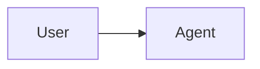

# Agent Interaction Record Spec

Version: 1.0

This spec defines a Markdown format for storing topic-relevant conversation history between a user and an agent. It is intended for review, hand editing, and rendering by `interaction-viewer.html`.

## Goals

- Store only meaningful user-agent interaction history.
- Exclude tool calls, command output noise, status-only progress chatter, and unrelated side conversations.
- Preserve each question/answer turn as an independently collapsible unit.
- Keep the file readable as plain Markdown.

## File Structure

An interaction record is a UTF-8 Markdown file with optional YAML front matter followed by one or more QA turns.

```markdown
---
spec: agent-interaction-record
version: 1.0
title: Example Conversation
created: 2026-06-26
participants:
  user: User
  agent: Agent
topic: Short topic description
---

# Example Conversation

## Turn 1: Short turn title

### User

User message content.

### Agent

Agent response content.

### Notes

Optional curator note. This section is not required.
```

## Front Matter

Front matter is optional. When present, it must be the first block in the file and must be enclosed by `---` lines.

Recommended fields:

| Field | Required | Description |
| --- | --- | --- |
| `spec` | No | Recommended value: `agent-interaction-record`. |
| `version` | No | Spec version used by the record, such as `1.0`. |
| `title` | No | Display title for the interaction record. |
| `created` | No | Creation date in `YYYY-MM-DD` format. |
| `updated` | No | Last update date in `YYYY-MM-DD` format. |
| `participants.user` | No | Display name for the user. |
| `participants.agent` | No | Display name for the agent. |
| `topic` | No | Short description of the conversation topic. |
| `source` | No | Optional source identifier, if the record was exported from another system. |

The HTML viewer recognizes simple `key: value` fields and common nested fields such as `participants.user`. Complex YAML is allowed for human readers but may not be fully interpreted by the viewer.

## Turn Format

Each QA turn must start with a level-two heading:

```markdown
## Turn N: Optional turn title
```

`N` should be a positive integer. The optional title should summarize the turn.

Each turn must contain:

```markdown
### User
```

followed by the relevant user request, question, or instruction, and:

```markdown
### Agent
```

followed by the agent response that should be preserved.

Optional sections:

```markdown
### Notes
```

Curator notes, constraints, decisions, or follow-up context.

```markdown
### Tags
```

A comma-separated list of tags.

## Inclusion Rules

Include:

- User requests, clarifications, and constraints that affect the topic.
- Agent answers, decisions, implementation summaries, and final outcomes.
- Important assumptions or unresolved questions when they are relevant to understanding the exchange.

Exclude:

- Raw tool calls, command invocations, command output, stack traces, and build logs unless the content itself is the subject of the conversation.
- Progress-only messages such as "I am checking files now" unless they contain a durable decision.
- Unrelated social, administrative, or side-topic messages.
- Sensitive secrets, credentials, private tokens, or unnecessary personally identifying information.

## Markdown Support

Section content may contain normal Markdown: paragraphs, lists, links, code fences, tables, inline code, LaTeX formulas, and Mermaid diagrams.

LaTeX formulas may use inline delimiters such as `$E = mc^2$` or `\(E = mc^2\)`, and block delimiters such as:

```markdown
$$
\sum_{i=1}^{n} i = \frac{n(n+1)}{2}
$$
```

Mermaid diagrams should use a fenced code block with the `mermaid` language:

````markdown

````

Because the parser uses headings to split turns and roles, avoid unescaped headings exactly matching `## Turn`, `### User`, `### Agent`, `### Notes`, or `### Tags` inside quoted content. If such text must be preserved, put it inside a fenced code block.

## Compatibility Requirements

A compliant viewer should:

- Load a local `.md` or `.markdown` file selected by the user.
- Parse front matter when present.
- Parse all `## Turn` sections.
- Render each turn as one collapsible block.
- Render `User`, `Agent`, and optional metadata sections separately.
- Ignore tool-call records because they should not be present in compliant files.

## Hook Recorder

`record_interaction.py` can append records in this format automatically.

Explicit append:

```bash
python3 record_interaction.py \
  -o interaction-history.md \
  append \
  --user "User request" \
  --agent "Agent response" \
  --turn-title "Short title"
```

Hook stdin mode:

```bash
cat hook-event.json | python3 record_interaction.py -o interaction-history.md
```

Supported hook payload shapes include:

- `{ "messages": [{ "role": "user", "content": "..." }, { "role": "assistant", "content": "..." }] }`
- `{ "conversation": [...] }`, `{ "turns": [...] }`, `{ "transcript": [...] }`, or `{ "history": [...] }`
- `{ "prompt": "...", "response": "..." }`

The recorder ignores `system`, `developer`, `tool`, and `function` roles, and skips content parts with types such as `tool_use`, `tool_result`, `function_call`, and `function_result`.
