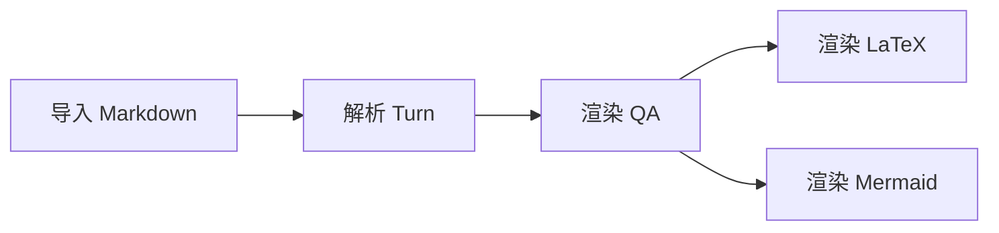

# HTML Interaction Viewer

## Turn 1: 定义目标

### User

帮我创建一个 HTML 工具，能够以一定的 spec 呈现出我和 agent 对话/交互的历史。不要记录工具调用，不记录和主题无关的对话。

### Agent

可以。记录格式应聚焦于主题相关的用户请求、agent 回答、关键约束和最终结论。工具调用、临时状态更新、无关闲聊和敏感信息不进入记录。

### Notes

本轮确定了记录范围：只保留主题相关的人机交互内容。

## Turn 2: 导入和折叠需求

### User

再额外定义一个 spec 文件，描述如何按格式存储交互记录。HTML 工具可以导入按 spec 记录的交互 md 文件，呈现交互内容。要求，每轮 QA 可以单独折叠和展开。

### Agent

实现为一个无需构建的静态 HTML 文件。它通过文件选择器读取 Markdown 记录，解析 front matter 和 `## Turn` 分段，再把每轮渲染成独立的 `
` 折叠块。每轮内分开展示 User、Agent 和可选 Notes。

### Tags

html, markdown, spec, collapsible

## Turn 3: 公式和图示

### User

记录里可能包含数学公式和流程图，希望 HTML 查看器能直接渲染。

### Agent

查看器支持行内 LaTeX，例如 $E = mc^2$，也支持块级公式：

$$
\sum_{i=1}^{n} i = \frac{n(n+1)}{2}
$$

Mermaid 图可以写在 fenced code block 里：

### Tags

latex, mermaid, mathjax
